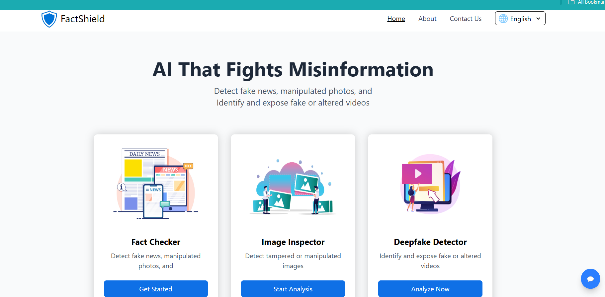
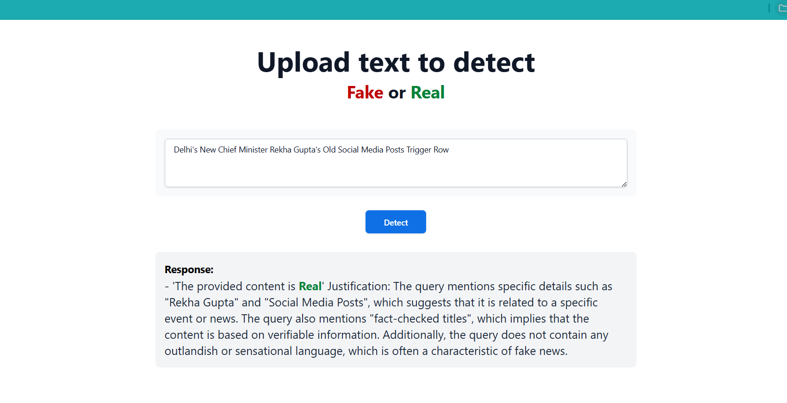
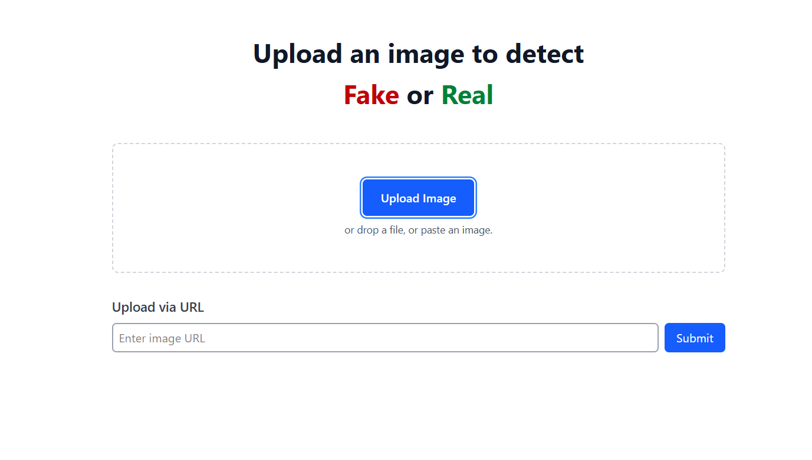
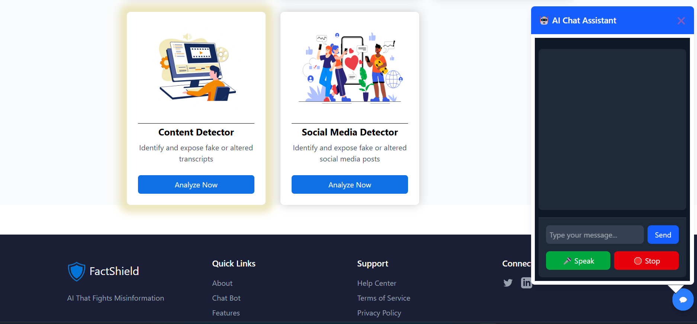

# 🛡️ Fact Shield

**Fact Shield** is an AI-powered platform for **real-time detection of fake news, images, and videos**, combined with a smart **AI chatbot** that helps users verify questionable content. The system leverages trusted sources (Google Fact Check API), advanced Machine Learning models (for text and media), and natural language interaction to provide transparent and reliable verdicts.

---

## 📸 Screenshots

| Home Page | News Check | Deepfake Detection | Chatbot |
|-----------|------------|--------------------|---------|
|  |  |  |  |

---

## 🚀 Features

- 📰 **Fake News Detection**: Real-time detection using Google Fact Check API + LLM model
- 🧠 **AI Justification**: Explains the verdict with confidence and reasoning
- 🖼️ **Fake Image Detection**: Classifies real vs deepfake images using CNN/DL models
- 🎞️ **Fake Video Detection**: Analyzes videos for deepfake traces (face swap, manipulation)
- 💬 **Interactive Chatbot**: Provides answers, helps verify content, and explains results
- 📊 **Confidence Scores** and visual indicators for user trust

---

## 🧠 How It Works

1. **User Input:** News, image, or video is submitted.
2. **Text Route:**
   - Google Fact Check API queried.
   - If not found → in-house LLM (e.g., LLaMA 3.3) evaluates content.
3. **Media Route:**
   - Image: CNN model or DeepFake detection (ResNet)
   - Video: Frame extraction + AI model classification
4. **Chatbot:** Built using Dialogflow or Rasa, guides and supports users.

---

## 🛠️ Tech Stack

### Frontend
- React.js
- Tailwind CSS and  Bootstrap
- Axios

### Backend
- Python (Flask,Django)
- REST APIs
- Google Fact Check API
- TensorFlow 

### AI/ML Models
- 📰 NLP LLM for news detection (LLaMA 3.3)
- 🖼️ CNN-based fake image detection
- 🎞️ Deepfake video classifier
- 🤖 Dialogflow chatbot

---
